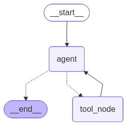

# Multi-Agent RAG Pipeline

---
## Overview
AI-Agent-RAG-Pipeline is an intelligent assistant designed for developers and AI enthusiasts to explore 
how agentic systems make autonomous **decisions**. It combines **real-time weather insights** and 
**document-based question** answering using **LangGraph**, **LangChain**, and **Qdrant**, showcasing how 
AI agents can dynamically choose and execute tools to deliver accurate, context-aware responses.
---
## How it works

### LangGraph Node Workflow

<div align="center">
  
</div>)

- AI-Agent-RAG-Pipeline is an intelligent agentic application built using LangGraph and LangChain 
- it dynamically decides when to fetch real-time weather data or perform document-based question answering using Retrieval-Augmented 
Generation (RAG). 
- It leverages a Qdrant vector store for context retrieval, 
- Integrates custom logging, exception handling
- Evaluation via LangSmith, and includes pytest-based testing for reliability.  
- A Streamlit interface for user interaction and visual assets 
- Illustrated test cases, evaluations, and workflow graphs.
This approach ensures that responses are grounded in the actual content of your resume rather than generic advice.
---

## Features
- Agentic workflow using LangGraph  
- Real-time weather data via OpenWeatherMap API  
- Document-based Q&A using Retrieval-Augmented Generation (RAG)  
- Qdrant vector database for storing and retrieving embeddings  
- Custom logger and exception handling  
- Evaluation with LangSmith  
- Unit tests with Pytest  
- Streamlit interface for user interaction
---

## 📦 Setup Instructions

1. **Clone the Repository**
   ```bash
   git clone https://github.com/sayed-ashfaq/AI-Agent-RAG-Pipeline.git
   cd AI-Agent-RAG-Pipeline

2. **Create virtual environment**
   ```bash
   python -m venv venv
   source venv/bin/activate     # On Windows: venv\Scripts\activate
   
3. **Add Environment Variables**
   ```bash
   Create a .env file in the project root:
   
   OPENWEATHER_API_KEY=your_api_key_here
   OPENAI_API_KEY=your_langchain_api_key
   LANGSMITH_VARIABLES(OPTIONAL) if you want to trace you agent
4. **Update Configuration (Optional)**<br>
Modify values in config.yaml for your own llm/embedding models and other hyperparameters.

5. **Run the Application**
   ```bash
   streamlit run Chat_Engine.py
---
🧩 Implementation Details

The system follows a modular, agentic workflow built using LangGraph:

1. LLM Node – Acts as the decision-maker, determining whether to use a tool or respond directly.
2. Tool Node – Executes the chosen tool (Weather or RAG) and returns the result.
3. should continue Loop – Passes control back to the LLM node to decide whether to continue or end the conversation.
4. Qdrant Vector Store – Manages embeddings and supports document retrieval for the RAG pipeline.
5. Custom Logger & Exception Handler – Ensures consistent debugging and traceability.
6. LangSmith Evaluation – Monitors LLM performance, correctness, and tool usage.
7. T Suite (Pytest) – validated weather API, RAG flow, and decision graph consistency.
---
## 📸 Screenshots & Visuals

### Streamlit Interface


### LangSmith Evaluation Results


### Workflow Graph


### Logs & Test Results


## Project Structure
```bash
## Project Structure
AI-Agent-RAG-pipeline/
├── data/
│   # Sample documents & PDFs for RAG processing and evaluation
│
├── evaluations/
│   # LangSmith evaluation notebooks
│   └── langsmitheval.ipynb
│
├── notebooks/
│   # Notebooks for prototyping, testing, and experiments
│   ├── experiment.ipynb
│   ├── prototype.ipynb
│   ├── vector_service.ipynb
│   └── weather_tool.ipynb
│
├── pages/
│   # Front-end/Streamlit pages (if any)
│   └── 1_About.py
│
├── resources/
│   # Images/screenshots for README or evaluation documentation
│   # (e.g., LangSmith visuals, pytest results)
│
├── logs/
│   # Log files for debugging and workflow runs
│
├── src/
│   ├── config/
│   │   └── config.yaml               # App configuration (API keys, paths)
│   │
│   ├── prompt_library/
│   │   └── system_prompt.py          # System prompts for LLM agents
│   │
│   ├── tools/
│   │   ├── rag_agent/                # Core RAG agent logic
│   │   │   ├── document_loader.py
│   │   │   ├── retriever.py
│   │   │   └── schemas.py
│   │   │
│   │   └── wheather_agent/           # Weather tool logic (rename if needed)
│   │       ├── weather.py
│   │       └── schemas.py
│   │
│   ├── utils/
│   │   ├── config_loader.py          # Load configurations
│   │   └── model_loader.py           # Load models
│   │
│   └── workflow/
│       └── agent_workflow.py         # LangGraph pipeline orchestration
│   
├── tests/
│   # Unit tests for RAG, weather, and agents
│   ├── test_agent.py
│   ├── test_agent_rag.py
│   └── test_weather_api.py
│
├── custom_logger/
│   └── logger.py                      # Centralized logging utility
│
├── exception_handler/
│   └── agent_exceptions.py            # Custom exceptions for agents
│
├── vector_store/
│   ├── meta.json
│   └── collection/
│       # SQLite DBs for different vector collections
│       └── second-collection/
│           └── storage.sqlite
│
├── .env      # for storing environment vairables
├── .gitignore
├── README.md
├── requirements.txt
├── pyproject.toml
│
└── Chat_engine.py                 # Main chat engine orchestrating agents

```
### 🛠️ Future Enhancements

- Multi-modal document support (images, tables)
- Advanced filtering and search options
- Integrate additional APIs (news, finance, knowledge)
- Deploy as a REST or FastAPI microservice


